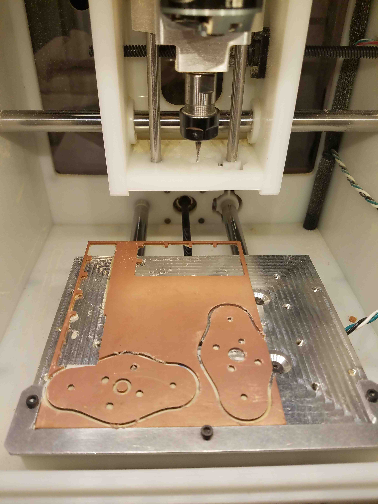

# DYI-Replacement-Motormount-for-ELEV-8
Files for making your own replacement motor mounts for the [Parallax ELEV-8 drone](https://www.parallax.com/product/elev-8)

###Crash!

I crashed my Parallax ELEV-8 drone (testing some stuff for Makerfaire NYC 2016!). 

The motormounts were smashed so I checked if I could...

###[Buy replacement motomounts directly from Parallax](https://www.parallax.com/product/721-80304)

Parallax sells the exact replacement part. They are made from 0.093 inches thick black acetal. They cost a reasonable for $3 each. 

Of course it is Friday night, so even if with an overnight shipping upgrade, I'd be grounded at least for the next 5 days. 

Maker Faire is 2 weeks away and there is (obviously) at least one crash-inducing problem to work out, so that wouldn't work. 

###Make replacement motor mounts!

I have a laser cutter, and converting bits into flat plastic shapes is exactly what laser cutters do best! Whoo hoo, I'll have my motormounts in no time!

###[Original SolidWorks file](721-80304.SLDPRT)

Parallax generously supplies files for all the parts in the ELEV-8!

But SolidWorks is [way too fancy](https://www.cati.com/blog/2015/04/how-much-does-solidworks-cost/) for me, so instead I import the part into...

###[OnShape](https://www.onshape.com/)

...which is a free and pretty nice web-based 3D cad program that happens to be able to import SolidWorks files. 

Here is what I ended up with...

https://cad.onshape.com/documents/87f6dc6947cb4aeb3c7f5888/w/89525256ab03b4d9a79cea25/e/45e0d6c32f898424b1c1b571

That looks familiar! I'll take 4 of those to go please!

I exported the face to a flat DXF R13 file...

[721-80304 - Face.dxf](721-80304 - Face.dxf)

Unfortunately my laser cutter does not speak DXF, but I can import the DXF into...

###[Inkscape](https://inkscape.org/en/)

...which is a free program that can import DXF and export the SVG files my laster cutter craves!

Sadly, Inkscape balked at the DXF (as often happens with DXF files) with a "POLYLINE encountered and ignored" error, so no joy on this path.

This must be my punishment for trying to use a cutting-edge web-based CAD tool. Serious people who want to get things done use
use serious CAD workstations running serious tools like...

###[Fusion 360 ](http://www.autodesk.com/products/fusion-360/overview)

...which is a free and nice desktop-based 3D cad program that can also import SolidWorks files.

Here is what I ended up with...

http://a360.co/2clur11

There are my motomounts again!

I converted the face to a sketch (to 2D-ify it) and again exported the sketch as a DXF...

[721-80304 - Face F360.dxf](721-80304 - Face F360.dxf)

...which again seemed to make Inkscape vomit bits in the same way.

Hmmm... getting an SVG to send to the laser cutter is turning out to be a lot of hassle! We need some latteral thinking here!

While pondering my move, I notice out of the corner of my eye the very handy...

###[Othermill PCB cutter](https://othermachine.co/)

PCBs are sort of the right thickness and are probably strong enough, so if I can just make a PCB board that happens to 
be exactly the same shape as a motormount... Hmmm... A hack to be sure, but it should (could?) work!

Sadly the newest version of the Othermill software can not directly import a DXF file (maybe someday Othermill people? Please?).

Luckily, I know from experience that I can usually import DXF files into...

###[DipTrace PCB layout software](http://www.diptrace.com/)

...which happy complied! I specified to import the "visible" layer from the DXF into the "Board Outline" layer of the 
board and ended up with a motormount shaped board!....

[Motormount Board Outline with drill hit holes.dip](Motormount Board Outline with drill hit holes.dip)

Those are the boards I've been looking for! 

I quickly exported the board outline to a gerber file...

[BoardOutline.gbr](BoardOutline.gbr)

...and jogged over to mill to load the file into...

###[Otherplan](https://othermachine.co/otherplan/)

...which is the software that reads in gerber files and actually cuts the boards on the Othermill.

Hey! I have a gerber and I want a board, so I the rest is just ceremony- right?

Turns out that Otherplan can not even load my gerber file! It [has not implemented the gerber "G85" command](https://othermachine.co/support/pcb/troubleshooting/) 
which is used to describe internal board cutouts. Boo Hoo (maybe someday OtherMill people? Please?).

Luckily those internal cutouts happen to be exactly round circles so if can convert the cutouts to...

###Drill hits

...I can create a gerber file for the outside outline of the shape, and then create an [Excelon drill hits file](https://en.wikipedia.org/wiki/Excellon_format) for the 
round interior cut-outs!

This turns out to be slightly tedious because there is no good way to replace a cutout with a matching hole. I have to manually measure the cutouts 
and then carefully manually place a drill hit in the center of each cutout, but eventually I end up with this... 

...from which I can generate an outline gerber...

[BoardOutline No Holes.gbr](BoardOutline No Holes.gbr)

...and a drill hits file...

[Through.drl](Through.drl)

###Ready to Cut!

###Oh happy day!

(A few flights later, I can report that a stack of two 1.54mm FR1 PCBs work as a motor mount- at least for the placid maneuvers I am doing.)
